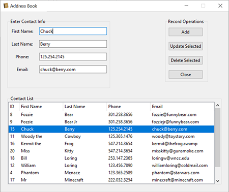
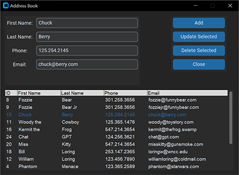
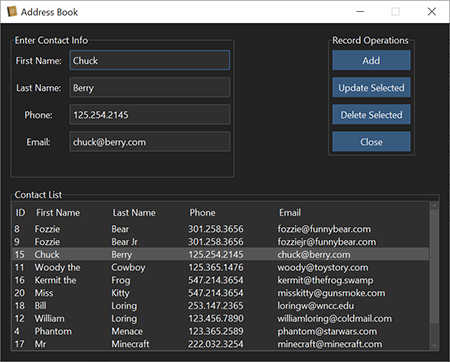

# Address Book built with Python, SQLite, and Tkinter

This project is designed to demonstrate how to implement the MVC (Model, View, Controller) design pattern in Python with SQLite. I decided to create different Python UI library versions. Each UI (View) uses the same Controller (db_operations.py) and database (address_book.db).

## tkinter.ttk

tkinter.ttk library built in to Python.

## customtkinter

https://customtkinter.tomschimansky.com/

## ttkbootstrap

https://ttkbootstrap.readthedocs.io/en/latest/

- Added sorting functionality to the column headings.

## PySide6

https://www.pythonguis.com/pyside6-tutorial/

- Added sorting functionality to the column headings.

## PySide6 Dark

- Added sorting functionality to the column headings.

### Purpose

I am an Information Technology Instructor at [Western Nebraska Community College](https://www.wncc.edu). I teach Information Technology, CyberSecurity and Computer Science. Best job ever!

Visit our Facebook page: [Facebook WNCC IT Program](https://www.facebook.com/wnccitprogram/)

### License
 This work is licensed under a <a rel="license" href="http://creativecommons.org/licenses/by-nc-sa/4.0/">Creative Commons Attribution-NonCommercial-ShareAlike 4.0 International License</a>.

Copyright (c) 2024 William A Loring